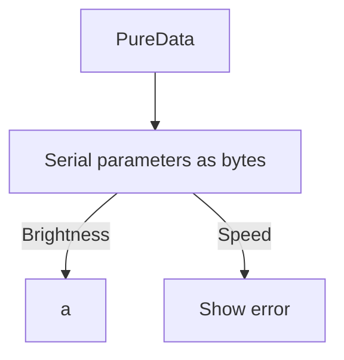

## Polyrhythm Logic Stucture and Code Review



### BurstAnimation:
```cpp
/// @file    arduinotest.ino
/// @brief   Send bounce from the start to end of the LED and bounce back.
/// @example Blink.ino

// pins and libraries
#include <FastLED.h>
#define NUM_LEDS 37
#define DATA_PIN 6
#define CLOCK_PIN 13

// global variables
int Colour1 = 192; 
int Colour2 = 160; 
int Saturation = 255; 
int brightness = 255;
int Colour = 100; 
int maxDistance = 6; // need edge case
int coloursArray[] = {
  100, 125, 150, 175, 200, 225, 250}; // sample array
int LEDIndex = 16;
CRGB leds[NUM_LEDS]; // delcares array of CRBG objects

void setup() { 
  Serial.begin(9600); // baud rate same as PD
  FastLED.addLeds<CHIPSET, LED_PIN, COLOR_ORDER>(leds, NUM_LEDS);
  FastLED.setBrightness(128); // default brightness
  fill_solid(leds, NUM_LEDS, CRGB::Blue); // default colour hue
  FastLED.show();
  // FastLED.clear();
}

void loop() { 
  burstAnimation(LEDIndex, coloursArray);
  }

// functions
void burstAnimation(int ledIndex, int* coloursArray){
  for (int i = 0; i <= maxDistance; i++) {
    int right = ledIndex + i;
    int left = ledIndex - i;
    int newBrightness = brightness - i*2;

    leds[right] = CHSV(coloursArray[i], Saturation, newBrightness); 
    leds[left] = CHSV(coloursArray[i], Saturation, newBrightness); 

    delay(500); 
    FastLED.show();
    }
```

#### Notes
- Edge detection, determine out of bounds region or cap on `LEDIndex` based on `maxDistance`
- Static and dynamic parameters
    - `brightness`
    - `speed`
    - `colour` or `coloursArray`
    - `saturation`
    - `LEDIndex`
    - `maxDistance`
    - `timeDelay`
- Colour arrays for burst
    - Swatch palettes
    - `brightness` dropoff
    - Do the leds turn off one by one from the middle? OR does the entire burst stay for a certain `timeDelay`?
- Need to reorganize gloabl variables
    - Declare static variables for variables not shared between functions?


### BounceAnimation:
```cpp
void BounceAnimation(int brightness) {
  for (int i = 0; i <= NUM_LEDS; i++) {
    leds[i] = CHSV(Colour1, Saturation, brightness);
    FastLED.show();
    delay(200);
    leds[i] = CRGB::Black;
  }

  for (int i = NUM_LEDS - 1; i >= 0; i--) {
    leds[i] = CHSV(Colour2, Saturation, brightness);
    FastLED.show();
    delay(200);
    leds[i] = CRGB::Black;
  }
}
```
#### Notes
- Define variables
    - `coloursArray` OR `colour`
    - `speed`
    - `timeDelay`
    - `brightness` 
- Trail preset required? If so, how does PD manage sending colour arrays? Send hsilder values, or create bang to trigger different contrsuted palettes that send bytes for each colour hue? 
- Physics or ratio for trail scaling
- Look into state machine approach for code structure
- Look into using `millis()` over `delay()` to create non-blocking code


### Brightness Control:
```cpp
void loop() {
  if (Serial.available() > 0) {
    int brightness = Serial.read(); // read 0–255
    brightness = constrain(brightness, 0, 255);
    FastLED.setBrightness(brightness);
    FastLED.show();
  }
}
```
### Notes
- *This has been refined in latest test
- Checks for serial connection, reads one byte
- Variables
    - `brightness` is quantized or linear 0-255?
        Quantized modes 0%, 50%, 100% to ensure smooth update


### Main Control Center
```cpp
// Libraries
#include <FastLED.h>
#define NUM_LEDS 37
#define DATA_PIN 6

// Static variables
int initial_colour = 100;
int final_colour = 200;
int initial_saturation = 255;
CRGB leds[NUM_LEDS]; 

// Update variables
int brightness = 100;
int speed = 100;
int colour = 0; // red for first index of CHSV format 
char current_state = 'C'; //idle state to be updated in the loop

void setup(){
  Serial.begin(19200); // match with PureData baud rate
  FastLED.addLeds<NEOPIXEL, DATA_PIN>(leds, NUM_LEDS);
  //FastLED.setBrightness(100); // default brightness
  //fill_solid(leds, NUM_LEDS, CRGB::White);
  FastLED.show();
}

void loop() {
  if (Serial.available() > 0) {
    char trigger = Serial.read();

    if (trigger == 'D' && Serial.available() > 0) brightness = Serial.read();
    else if (trigger == 'E' && Serial.available() > 0) speed = Serial.read();
    else current_state = trigger;
  }
  trigger_state(current_state); 
  delay(100);
}

void green(int brightness){
  FastLED.clear();
  leds[0] = CHSV(96, initial_saturation, brightness);
  FastLED.show();
}

void red(int brightness){
  FastLED.clear();
  leds[0] = CHSV(0, initial_saturation, brightness);
  FastLED.show();
}

void idle(){
  fill_solid(leds, NUM_LEDS, CRGB::White);
  FastLED.show();
}

void clear(){
  FastLED.clear();
}

void trigger_state(char state){
  switch(state){
      case 'A': // 65 
        BounceAnimation(brightness); break;
      case 'B': // 66
        red(brightness); break;
      case 'C': // 67
        idle(); break;
      default: clear(); break;
  }
}

void BounceAnimation(int brightness) {
  FastLED.clear();
  for (int i = 0; i <= NUM_LEDS; i++) {
    if (current_state != 'A') return;
    leds[i] = CHSV(initial_colour, initial_saturation, brightness);
    FastLED.show();
    //delay(200);
    leds[i] = CRGB::Black;
  }

  for (int i = NUM_LEDS - 1; i >= 0; i--) {
    if (current_state != 'A') return;
    leds[i] = CHSV(final_colour, initial_saturation, brightness);
    FastLED.show();
    //delay(200);
    leds[i] = CRGB::Black;
  }
}
```
### Notes
    - non blocking code and state machines
    - `millis()` not `delay()`, state gets stuck in BounceAnimation and can't update brightness, then resets to idle after it exits